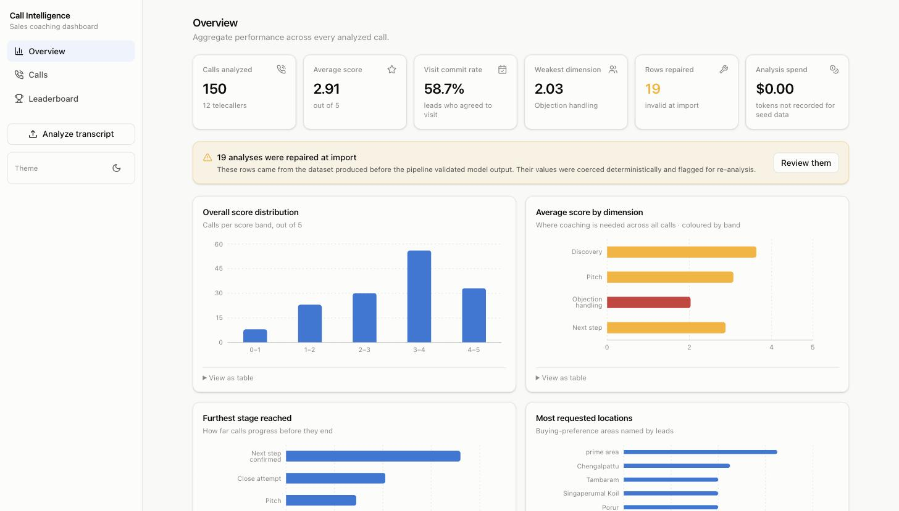
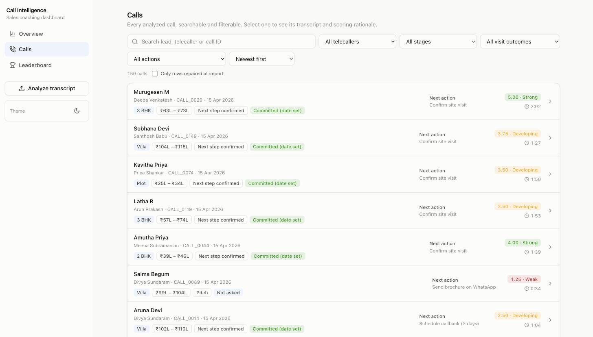
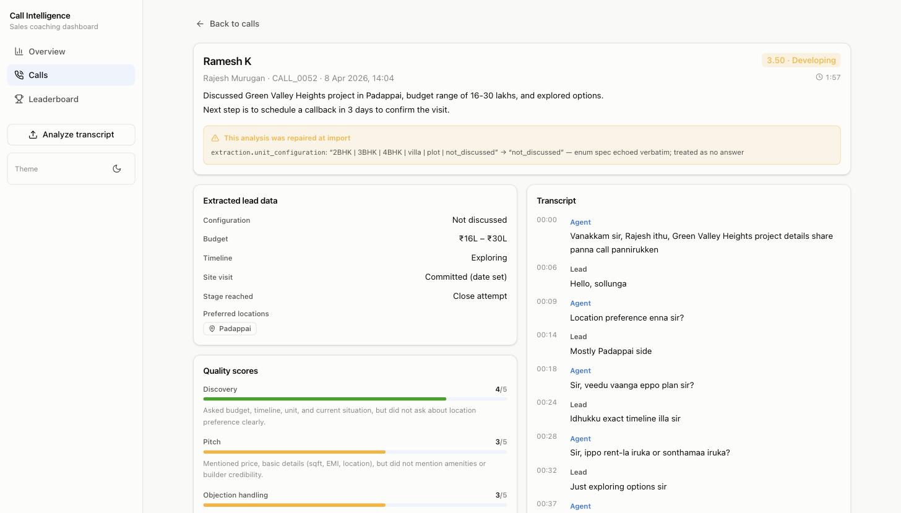
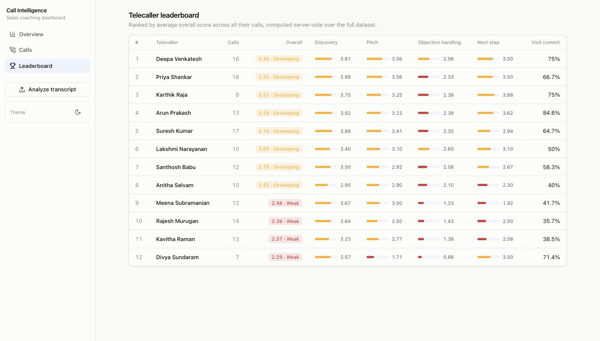

# Call Intelligence

Turns code-mixed Tamil–English real estate sales calls into structured lead data
and scored coaching feedback, and serves it as a manager dashboard.

150 recorded calls are analyzed by an LLM pipeline that extracts what the lead
wants, scores the telecaller on four dimensions with a written rationale, decides
the next action, and validates every field before it is allowed near the
database.

**▶ Live demo: https://call-intelligence-backend-p4p5.onrender.com**

_Hosted on Render's free tier, so the first request after a quiet period takes
30–60 seconds to wake. The dashboard shows skeletons while it does._



```
┌────────────────┐  transcript   ┌──────────────────────────────────────────┐
│  calls.jsonl   │──────────────▶│  shared/  — the contract                 │
│  (150 calls)   │               │                                          │
└────────────────┘               │  Zod schema ─── generates ───▶ prompt    │
                                 │       ▲                          │       │
                                 │       │ validates                ▼       │
                                 │       └───── Groq (llama-3.1-8b) ──┐      │
                                 │                                   │      │
                                 │   invalid ──▶ repair round-trip ───┘      │
                                 └────────────────────┬─────────────────────┘
                                                      │ validated analysis
                    ┌─────────────────────────────────▼─────────────────────┐
                    │  backend/  — Express 5 + Prisma                       │
                    │  paginated reads · leaderboard · analytics            │
                    │  rate-limited /upload · persistent cache              │
                    └─────────────────────────────────┬─────────────────────┘
                                                      │ typed DTOs
                    ┌─────────────────────────────────▼─────────────────────┐
                    │  frontend/  — React + Vite + Tailwind                 │
                    │  overview · calls · call detail · leaderboard          │
                    └───────────────────────────────────────────────────────┘
```

## What this project is actually about

The first version of this project ran the pipeline over 150 calls and shipped a
dashboard. It worked. It also wrote 19 invalid records into its own dataset
without noticing, because nothing validated the model's output.

That is the interesting problem, so the rewrite is built around it:

| The defect, found in the shipped data                            | The fix                                                                       |
| ---------------------------------------------------------------- | ----------------------------------------------------------------------------- |
| 6 rows answered `"2BHK \| 3BHK"` for a single-value enum         | Zod validates every field; the prompt states "exactly one value"              |
| 1 row echoed the entire enum spec line back as its answer        | Same validation catches it; the repair pass re-asks                           |
| 9 rows encoded "not discussed" as `{min_lakhs: 0, max_lakhs: 0}` | `.positive()` rejects the fake zero, forcing the honest sentinel              |
| 2 rows put a call _stage_ in the site-visit field                | The prompt separates the two fields explicitly; the schema rejects the mix-up |
| 13 rows broke the "exactly two sentences" summary rule           | Reported as a soft warning, surfaced in the UI                                |
| Extraction quality was never measured                            | `npm run eval` scores it against a hand-labelled golden set                   |

**Measured, not asserted.** Against 14 hand-labelled calls:

|                                | legacy pipeline | prompt v3 | prompt v4 |
| ------------------------------ | --------------- | --------- | --------- |
| Schema-valid on first try      | 35.7%           | **100%**  | **100%**  |
| Repair round-trips needed      | 9               | **0**     | **0**     |
| `budget_range` agreement       | 71.4%           | **92.9%** | 78.6%     |
| `timeline` agreement           | 35.7%           | **64.3%** | 50.0%     |
| `site_visit_outcome` agreement | 42.9%           | 28.6%     | 35.7%     |
| `last_stage_reached` agreement | 57.1%           | 21.4%     | 21.4%     |
| Aggregate field agreement      | 61.2%           | 57.1%     | 54.1%     |

Two conclusions, and the second is the more useful one:

**1. Validation is fixed, unambiguously.** Schema validity went from 35.7% to 100%
and repair round-trips from 9 to 0. The class of defect that wrote 19 invalid rows
into the original dataset can no longer reach storage.

**2. The accuracy numbers are not yet trustworthy — and the harness is what proved
it.** Running the _same_ prompt twice produced a 2-field difference (59.2%, then
57.1%), because the model runs at temperature 0.2. The v3→v4 gap is 3 fields. **The
measurement noise is the same size as the effect being measured**, so no claim
about which prompt is better overall is supportable from a single run.

That is a more honest position than a green number, and it says exactly what to do
next: measure with repeats (`npm run eval -- --consistency 5`) and report a mean
with a spread, or grow the golden set, before tuning the prompt further.

Full breakdown, the three distinct failure causes, and the fix list:
[docs/eval-results.md](docs/eval-results.md) and
[docs/prompt-engineering.md](docs/prompt-engineering.md).

## Quick start

```bash
cp .env.example .env      # optional: add GROQ_API_KEY to enable uploads
npm install
npm run db:migrate && npm run db:seed
npm run dev               # API on :5000, dashboard on :5173
```

The dashboard is fully usable **without** an API key — all 150 analyzed calls are
committed to the repo. A key is needed only to analyze a _new_ transcript.

## What you can do with it

- **Overview** — headline numbers plus four distributions: score bands, average
  by dimension (coloured by band, so the weakest area is obvious), how far calls
  progress, and which locations leads ask for.
- **Calls** — server-side search, six filters and six sort orders over 150 calls,
  with filter state in the URL so a view is shareable.
- **Call detail** — the transcript as speaker turns beside the extraction, all
  four scores with the model's written rationale, and the provenance of the
  analysis (model, prompt version, tokens, cost, latency).
- **Leaderboard** — telecallers ranked by average score, computed in SQL over the
  whole dataset, with per-dimension breakdowns and site-visit commit rate.
- **Analyze transcript** — paste a new call, get it scored and stored.

## Screens

**Calls** — server-side search, six filters and six sort orders over 150 calls.
Filter state lives in the URL, so a filtered view is shareable.



**Call detail** — the transcript as speaker turns beside the extraction and the
scores. The amber banner is a row the importer had to repair: it shows the exact
value the model returned (`"2BHK | 3BHK | 4BHK | villa | plot | not_discussed"`),
what it was changed to, and why.



**Leaderboard** — computed in SQL over the whole dataset, with per-dimension
averages so a ranking can be explained rather than just displayed.



## Project structure

Three top-level folders hold the application, plus `docs/`.

```
frontend/    the React dashboard          → deploys to Vercel
backend/     the Express API + database   → deploys to Render
shared/      code both of them import     → not deployed; built into each
docs/        decisions, prompt-engineering log, eval results, API reference
```

### backend/

```
backend/
├── src/
│   ├── index.ts                    entry point — starts the server
│   ├── app.ts                      Express setup, CORS, routes
│   ├── env.ts                      validated configuration (fails fast)
│   ├── constants.ts                fixed values (score bands, committed outcomes, paths)
│   ├── logger.ts                   structured logging with request ids
│   ├── db/
│   │   └── index.ts                Prisma client + health check
│   ├── models/
│   │   └── call.model.ts           the shape of a call: row types, includes, column builder
│   ├── controllers/                request logic, one file per resource
│   │   ├── call.controller.ts
│   │   ├── leaderboard.controller.ts
│   │   ├── analytics.controller.ts
│   │   ├── upload.controller.ts
│   │   └── health.controller.ts
│   ├── routes/                     URL → controller mapping, no logic
│   │   ├── call.routes.ts
│   │   ├── leaderboard.routes.ts
│   │   ├── analytics.routes.ts
│   │   ├── upload.routes.ts
│   │   └── health.routes.ts
│   ├── middlewares/
│   │   ├── errorHandler.ts         the single exit for every failure
│   │   ├── validate.ts             Zod request parsing
│   │   └── rateLimit.ts            protects the LLM-backed upload route
│   ├── utils/
│   │   ├── asyncHandler.ts         error-catching wrapper
│   │   ├── ApiResponse.ts          consistent success shape
│   │   ├── ApiError.ts             consistent error shape
│   │   ├── analysisService.ts      LLM call + persistent cache
│   │   ├── callMapper.ts           database row → API DTO
│   │   └── staticWeb.ts            serves the dashboard in single-origin mode
│   ├── data/                       the committed 150-call dataset
│   ├── eval/                       golden-set labels + evaluation runner
│   ├── seed.ts                     load the dataset into the database
│   ├── processCalls.ts             batch-analyze transcripts (and `--repair`)
│   └── validateDataset.ts          audit any dataset against the schema
└── prisma/                         schema.prisma + migrations
```

### frontend/

```
frontend/src/
├── main.tsx
├── App.tsx                         routes between the four screens
├── pages/
│   ├── overview-page.tsx           stat tiles + four charts
│   ├── calls-page.tsx              search, filters, pagination
│   ├── call-detail-page.tsx        transcript beside the analysis
│   └── leaderboard-page.tsx        telecaller ranking
├── components/
│   ├── ui/                         button, card, badge, dialog, toast, score bars
│   ├── calls/                      filters, row, pagination, transcript view
│   ├── dashboard/                  stat tiles and charts
│   ├── layout/                     app shell and navigation
│   └── upload/                     analyze-transcript dialog
├── hooks/                          data fetching (TanStack Query) + chart colours
├── lib/                            class merge, formatting, theme
└── services/
    └── api.ts                      all backend API calls
```

### shared/ — and why it exists

```
shared/src/
├── schema.ts                       the Zod contract — the single source of truth
├── api.ts                          the response envelope + DTO types
├── prompts/                        v1, v2, v3 — versioned, independently runnable
├── llm/                            Groq client, retry policy, cost accounting, pipeline
└── legacy.ts                       deterministic repairs for the 19 invalid rows
```

Three separate things need this code: the backend runs the pipeline on upload,
the frontend imports the types and enum labels, and the CLI tools run it for
evaluation and batch processing. If it lived inside `backend/`, the frontend
would have to import from `../backend/src/schema` — which breaks the moment the
two are deployed separately, because Vercel only ever sees the frontend folder.

That single schema is the authority on every legal value: the prompt's field spec
is _generated_ from it, the API validates against it, the seeder refuses rows that
violate it, and the dashboard derives its TypeScript types from it — so a renamed
field becomes a compile error in the browser rather than an `undefined` rendered
into the page.

### One response shape

Every successful response comes from `ApiResponse`:

```json
{ "success": true, "statusCode": 200, "message": "Calls fetched", "data": { … } }
```

Every failure comes from `ApiError`:

```json
{
  "success": false,
  "statusCode": 400,
  "code": "bad_request",
  "message": "Invalid query parameters",
  "errors": [{ "path": "stage", "message": "Invalid enum value…" }],
  "requestId": "b3f1c2e0-…"
}
```

The frontend unwraps `data` in exactly one place (`services/api.ts`), validating
the envelope and the payload together against the shared schemas. `requestId` is
echoed in the `x-request-id` header and appears in the server log, so a
user-reported failure can be traced to one request. Health probes are the
deliberate exception — they stay flat, because platform uptime checks expect a
plain body.

### If you know the old version

| Old                                                           | New                                                          |
| ------------------------------------------------------------- | ------------------------------------------------------------ |
| `frontend/` (CRA)                                             | `frontend/` — same role, rewritten with Vite                 |
| `Backend/server.js`                                           | `backend/src/` — split into controllers, routes, middlewares |
| `Backend/pipeline.js` **and** root `pipeline.js` (duplicated) | `shared/src/` — one copy                                     |
| `processCalls.js`                                             | `backend/src/processCalls.ts`                                |
| `processed_calls.json`                                        | `backend/src/data/calls.seed.json`                           |
| `test.js`                                                     | replaced by 93 tests in `shared/test/` and `backend/test/`   |

## Commands

| Command                                | What it does                                                      |
| -------------------------------------- | ----------------------------------------------------------------- |
| `npm run dev`                          | API and dashboard together                                        |
| `npm test`                             | 93 tests (schema, repairs, retry policy, pipeline, HTTP contract) |
| `npm run eval -- --offline`            | Score the committed dataset against golden labels — no API calls  |
| `npm run eval -- --prompt v1,v2,v3,v4` | Compare prompt versions live                                      |
| `npm run eval -- --consistency 3`      | Re-run each call 3× and report score spread                       |
| `npm run validate:dataset`             | Audit any processed-calls file against the schema                 |
| `npm run process-calls`                | Batch-analyze `backend/src/data/calls.jsonl`                      |
| `npm run process-calls -- --repair`    | Re-analyze only the rows flagged at import                        |
| `npm run db:reset && npm run db:seed`  | Rebuild the database from the dataset                             |
| `npm run typecheck` / `npm run lint`   | Verify everything                                                 |

## Engineering notes

Each of these is a decision with a reason, written up in
[docs/decisions.md](docs/decisions.md):

- **One LLM call per transcript**, not one per task — extraction, scoring, stage,
  action and summary come back together.
- **A schema violation earns one repair round-trip**, where the model is shown
  its own validation errors. A blind retry tends to reproduce the same defect.
- **One retry policy** with exponential backoff and full jitter, retrying 429 and
  5xx, failing fast on 4xx. The original code had two nested retry loops that
  could spend six API calls on a transcript with a bad API key.
- **The cache key includes the model and prompt version.** A cache keyed on the
  transcript alone serves analyses from a prompt you have since replaced.
- **Enum columns are strings in the database**, validated by Zod, so the enum
  lives in one place instead of three and the schema ports between SQLite and
  Postgres unchanged.
- **The API never returns transcripts in list responses.** The original `/calls`
  returned 378KB to render twenty rows.

## Documentation

| Document                                                 | Contents                                                                 |
| -------------------------------------------------------- | ------------------------------------------------------------------------ |
| [docs/decisions.md](docs/decisions.md)                   | Every significant decision, its alternatives, and what I would change    |
| [docs/prompt-engineering.md](docs/prompt-engineering.md) | v1 → v3, what each version got wrong, and how the failures were found    |
| [docs/eval-results.md](docs/eval-results.md)             | Measured field agreement and pipeline health                             |
| [docs/api.md](docs/api.md)                               | Endpoint reference                                                       |
| [docs/ai-usage.md](docs/ai-usage.md)                     | Which models and AI tools were used, and which suggestions were rejected |
| [backend/src/eval/README.md](backend/src/eval/README.md) | What the golden set labels, and why the 0–5 scores are not label-scored  |

## Deployment

Config for both platforms is committed, so the dashboards need almost no manual
setup: `vercel.json` at the repo root for the dashboard, `render.yaml` for the API.

**Split — Render + Vercel (the free-tier path).**

| Vercel setting           | Value                                 |
| ------------------------ | ------------------------------------- |
| Root Directory           | `./` (the repo root, not `frontend/`) |
| Install / Build / Output | taken from `vercel.json`              |
| `VITE_API_URL`           | the Render API URL, no trailing slash |

The dashboard is an npm workspace that imports `@call-intel/shared`, so install
and build have to run from the repo root — that is why Root Directory is `./` and
not `frontend/`. `vercel.json` also carries the SPA rewrite, without which
refreshing `/calls/CALL_0052` returns Vercel's 404 instead of the app.

| Render setting     | Value                                                                            |
| ------------------ | -------------------------------------------------------------------------------- |
| Root Directory     | blank (repo root)                                                                |
| Build Command      | `npm ci && npm run db:generate && npm run build:api`                             |
| Pre-Deploy Command | `npm run db:deploy`                                                              |
| Start Command      | `node backend/dist/index.js`                                                     |
| Health Check Path  | `/health/live`                                                                   |
| Env                | `CORS_ORIGINS` (the Vercel URL), `GROQ_API_KEY`, `DATABASE_URL`, `SERVE_WEB=off` |

**The database is PostgreSQL, hosted on Neon.** The host's filesystem is
ephemeral, so a SQLite file would be deleted on every restart — fine for the 150
seeded calls, not fine for a call someone uploads. Set `DATABASE_URL` to the Neon
connection string in both the Render dashboard and your local `.env`, then run
`npm run db:deploy && npm run db:seed` once. Neon's free tier sleeps when idle and
wakes on the next connection.

**Single service — everything on one host.** No Vercel, no second host, and no
CORS at all, because the dashboard and the API share an origin:

```bash
npm run build
NODE_ENV=production SERVE_WEB=on npm start -w @call-intel/backend
# http://localhost:5000 serves the dashboard; the API is under /api
```

In this mode the API moves under `/api` so the dashboard owns `/calls/:id`. That
switch is one env var (`SERVE_WEB`, documented in `.env.example`); `auto` means
production only, so a stale build can never change routing during `npm run dev`.

## Licence

MIT.
